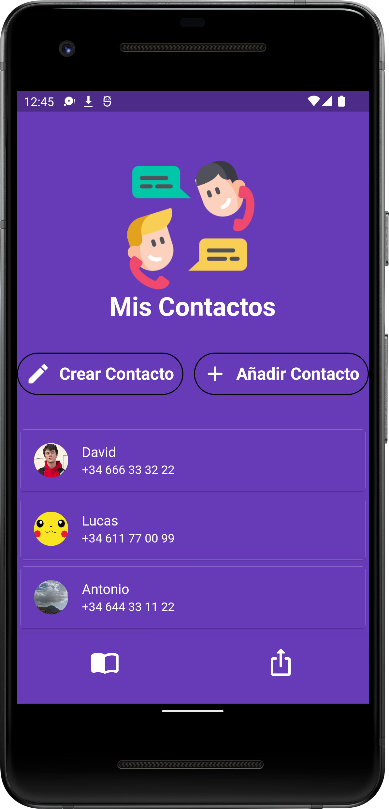
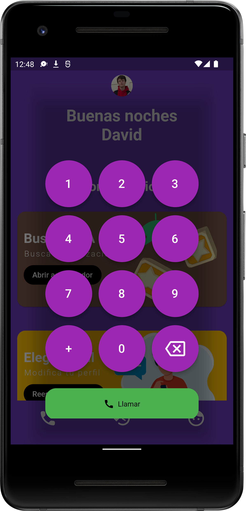
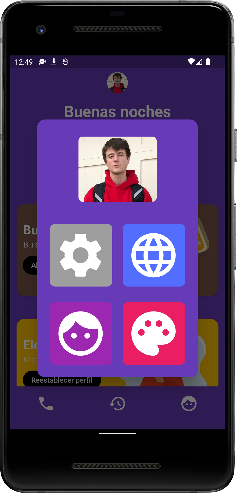
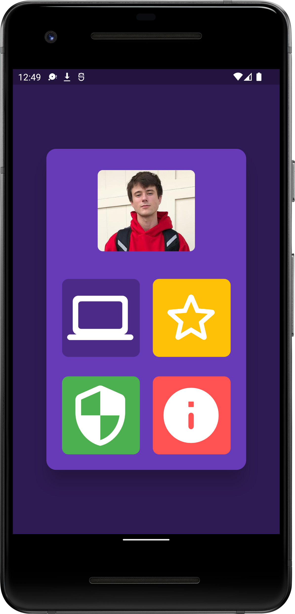
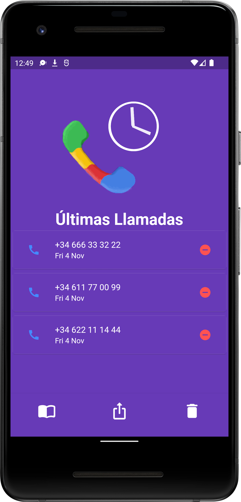

 


 # Material Dialer
 Dialer app made with Flutter(Dart)

# Platform Compatibility

- [x] android
- [x] web
- [x] linux desktop
- [x] windows desktop
- [ ] iOS
- [ ] fuchsiaOS

# Dependencies
All plugins used on this project
```
dependencies :
    url_launcher: ^6.1.6
    flutter_phone_direct_caller: ^2.1.1
    flutter_launcher_icons: "^0.10.0"
    flutter_native_contact_picker: ^0.0.3
    package_info_plus: ^3.0.1

```

 # Screens








 # Download
 Click <a href ="https://github.com/daviiid99/Material_Dialer/releases/download/latest/app-release.apk">here</a> to grab the latest build
