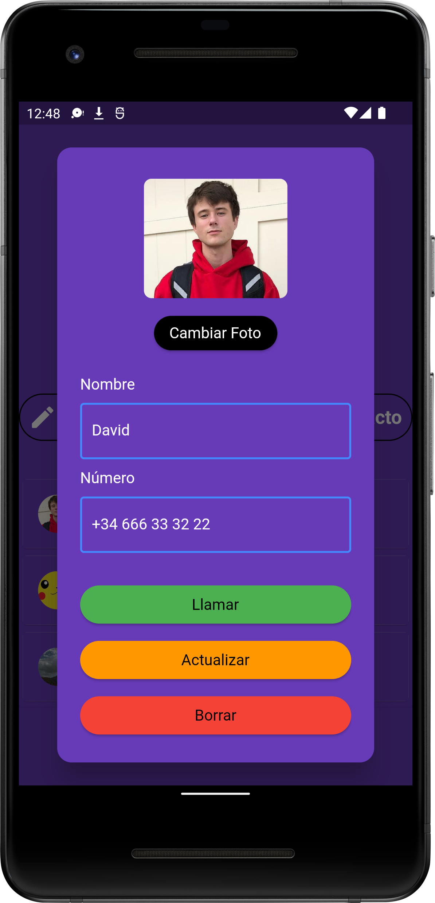

 # Material Dialer
 W.I.P Dialer app made with Flutter(Dart)

# Dependencies
All plugins used on this project
```
dependencies :
    url_launcher: ^5.4.2
    flutter_phone_direct_caller: ^2.1.1
    flutter_launcher_icons: "^0.10.0"
    flutter_native_contact_picker: ^0.0.3
```

 # Screens
| Home Screen             | Call Screen                | Contacts Screen            | New Contacts Screen | Settings Screen | Build Screen|
| :---------------------- |:----------------------     |:----------------------|:----------------------|:----------------------|:----------------------|
|                         |                            | ||||

 # Get the source
 ```
 git clone https://github.com/daviiid99/Material_Dialer Material_Dialer
 ```
